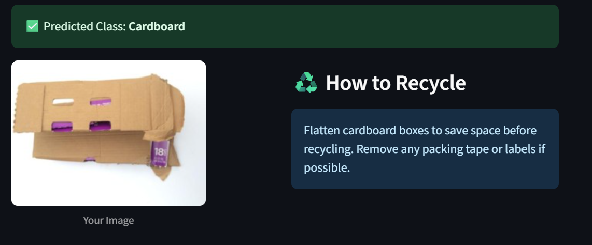

# ♻️ Smart Garbage Classifier

This project uses Deep Learning (EfficientNetV2B2) to classify garbage images into categories like plastic, glass, metal, etc., and provides recycling suggestions.

## 🔍 Features
- Waste image classification
- Real-time prediction via Streamlit UI
- Recycle tips for each category
- Upload your own waste image and get results instantly

## 🛠️ Tech Stack
- Python
- TensorFlow/Keras
- EfficientNetV2B2
- Streamlit
- PIL, NumPy
- Pandas

## 📷 Output Screenshot



## 🚀 How to Run

```bash
# Step 1: Install dependencies
pip install -r requirements.txt

# Step 2: Run the Streamlit app
streamlit run app.py
